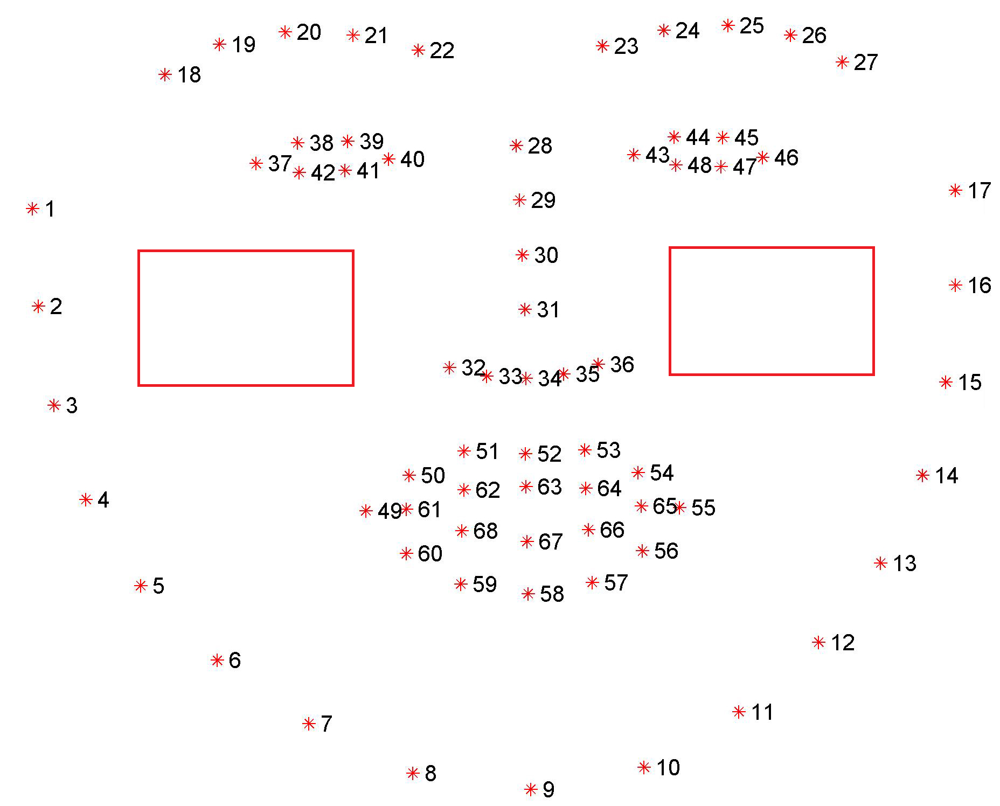

# Mouth opening

## Problem: 
Candidates may talk to seek help during the test. 

## Solution: 
Recognize whenever they do that.

## How-to-do: 

### Step 1: 

Take the video from the camera

### Step 2: 

Turn every frame into gray color, they use dlib to detect the face in the frame. 

### Step 3: 

For every face, use the dlib library to detect 68 points on the candidates face.

### Step 4: 

Take the landmarks for the mouth, then calculate the mouth ratio by the formula: 

Take the threshold, compare it with the mouth ratio, then decide whether it opening or not. 

I found the the optimal threshold is about 0.74