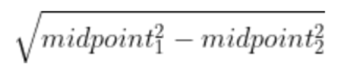
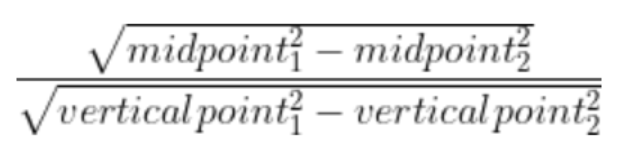

# Eye Blinking 

## Problem: 
Candidates may close there eyes during the test, we can measure it to decide the abnormal behaviors. 

## Solution: 
Recognize whenever they do that.

## How-to-do:

### Step 1: 

Use the dlib library to detect 68 different landmarks on the candidates face. 

### Step 2: 

Take every frame from the camera, flip it, turn it into gray color, then use the detector from the dlib library to detect faces.

### Step 3: 

For every face, take the landmarks from these faces.

### Step 4: 

To measure whether the candidates look up/down, we need to calculate the relationship between the closing and opening activities. 

**First idea**: Calculate the distance difference vertically based on formula: 

while midpoint = average of the 38-point and the 39-point or the 41-point and the 42-point

Problem: The answers may change depending on the facial angles. 

**Results:**

| Angle  |Eye's status   | Scores | 
|---|---|---|
|Face-up| Open |19.6   |  
|Face-down   | Open  |17.7   |  
|Face-center   |Open   |15.5   |  
|Face-up| Close |3.62   |  
|Face-down   | Close  |10.1   |  
|Face-center   |Close   |5.66  |  

**Second idea**: The perimeter of the eye is unchanged while the eye's closing or opening, to calculate the ratio between vertical distance and horizontal distance. 

**Results:**

| Angle  |Eye's status   | Scores | 
|---|---|---|
|Face-up| Open |0.313  |  
|Face-down   | Open  |0.298  |  
|Face-center   |Open   |0.342  |  
|Face-up| Close |0.097  |  
|Face-down   | Close  |0.1  |  
|Face-center   |Close   |0.117  |  

