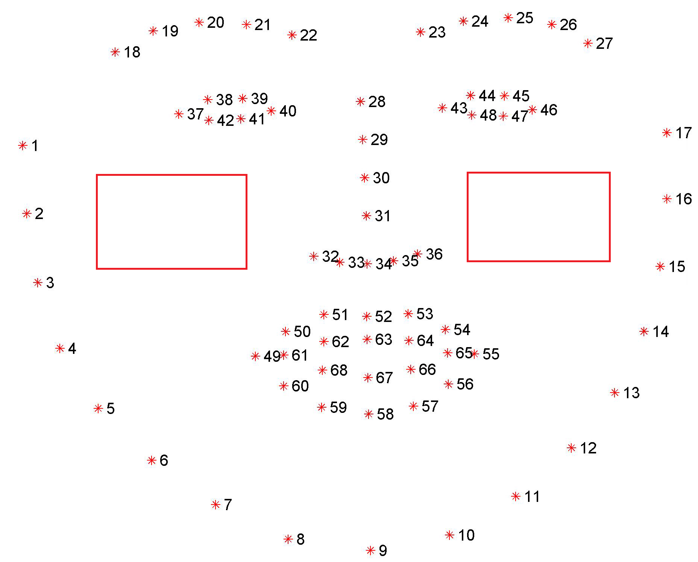

# Eye gazing 

## Problem 
Candidates may look up, down, left and right to seek for additional information 

## Solution 
Recognise whenever they do that. 

## How-to-do 

### Step 1: 

Take the video from the camera

### Step 2: 

Turn every frame into gray color, they use dlib to detect the face in the frame. 

### Step 3: 

For every face, use the dlib library to detect 68 points on the candidates face.

### Step 4: 
 
Calculate the gaze ratio. 

Calculate the eye's region by take the min_x, min_y, max_x, max_y, then divide that region into two part horizontally. 

Use the bitwise_and function to find the white part the eye, then find the white part ratio between two parts to find whether the candidates look right or left. 

Do exactly the same with the vertically to find whether the candidates look upper or lower the screen. 

**Result**: 
About horizontally: 
I found that, in the optimal conditions, there is no white light reflected on the eyes, the range while looking at the 15'6 inch screen is about 0,6 to 1,4 ratio. 
But there is some factor we need to consider, the light condition, the screen size and whether the candidates use glasses or not are affected to the results. 

About vertically: 
I found that, the range from the top of the camera to the end of the touchpad is about (0,4-1,1). But it's complicated here. Because when you look down, the system can't even recognize your eyes anymore, that takes me to other solutions, which is the head pose estimation. Other problem needs to be considered is the computer problem, the distance may quite different from the fixed range of the laptop. 

I always found that there are many scenarios we need to take into consideration, like the relationship between the head and the eyesight, to make sure the candidate can take the exam comfortably. 

