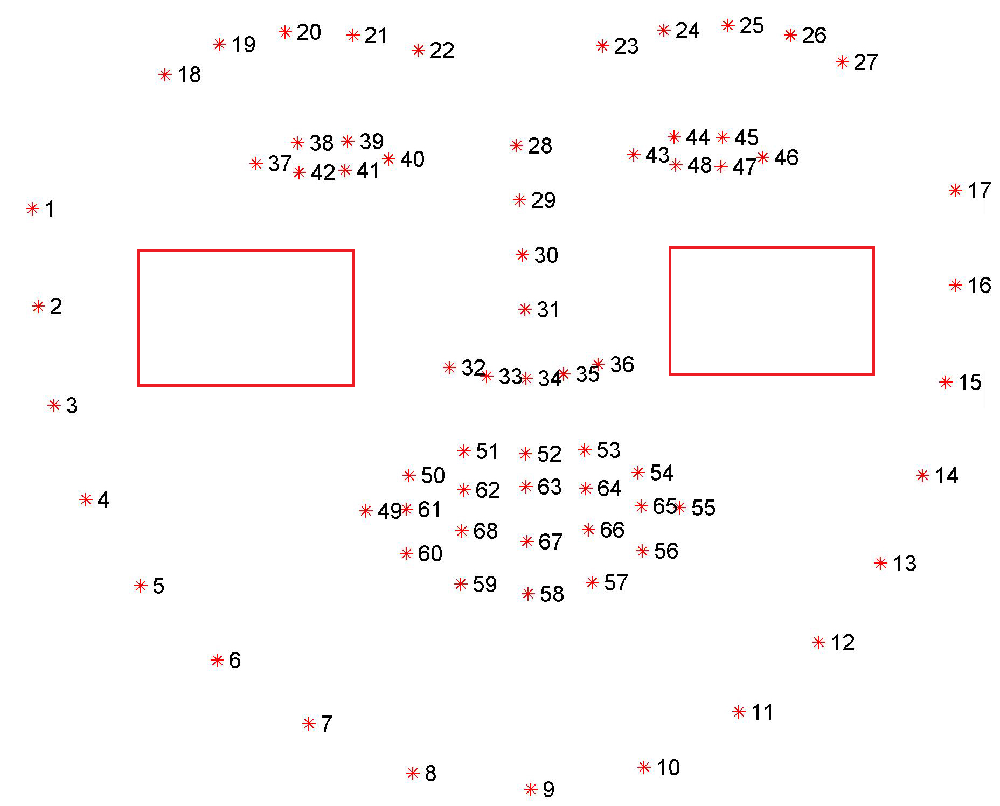
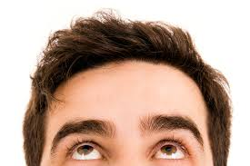
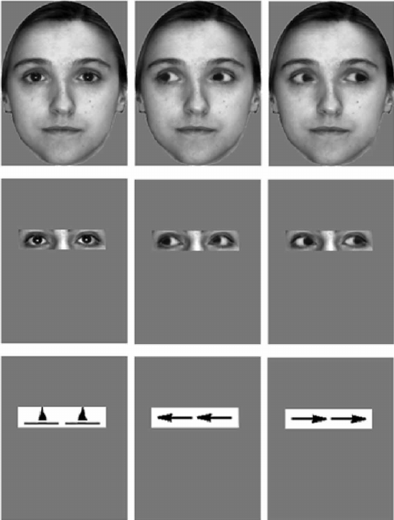
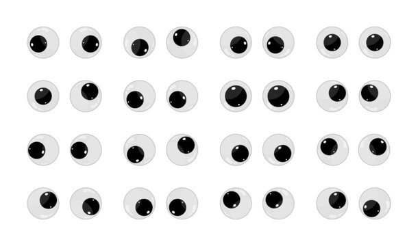

# Eye Gazing 

## Problem 
Candidates may look up, down, left and right to seek for additional information 

Smaller problems: 
- The candidates can look out of the screen horizontally: looking left or looking right. 
- The candidates can look of out the screen vertically: looking up. (not looking down because they will need to see the keyboard, and when they look under the table, we'll use the head pose estimation.)

## Solution 
Recognise whenever they do that. 

## How-to-do 

### Step 1

Use the dlib library to detect 68 different landmarks on the candidates face. 

### Step 2

Take every frame from the camera, flip it, turn it into gray color, then use the detector from the dlib library to detect faces.

### Step 3 

For every face, take the landmarks from these faces.

### Step 4 
 
Calculate the gaze ratio by taking these steps sequentially. 

- Take the eye region points (37 - 42 for left eye) and (43 - 46 for right eye). 
- Then I take the width and height from the frame, create a mask with the similar width and height. 
- I use polylines and fillPoly from CV2 to draw the eyes on the mask. 
- After that, I take all the mask into bitwise_and() function to recognise the eyes. 
- Now, I split the problem into two sub-problems: 
  - Horizontally: I divided the eyes into left sides and right sides, then I calculated the white part in every side, then taking the ratio between them. 
  - Vertically: I divided the eyes into upper sides and lower sides, then I calculated the white part in every side, then taking the ratio between them. 

**Results:**
- After testing, I found that the optimal ratios when the screen is 90 degree with the table and the candidates are not wearing glasses are: 

| Name           | Ratio       |  
|----------------|-------------|
| Left and Right | 0.6 and 1.3 |    
| Upper          | 0.5         |   

## Potential problems

During the test, there are still potential problems that I can't solve yet. 
- Apples of the eyes are abstract. 

- The white light may be reflected in the candidate's eyes. (wearing glasses/ the light rises directly to their eyes)
- The screen was put in different angles. (During the test, I found that the results may change a bit when changing the angles of the camera).

## Suggested Solutions 
- Force the candidates to put the optimal conditions.
- Make other algorithms to solve the problem.