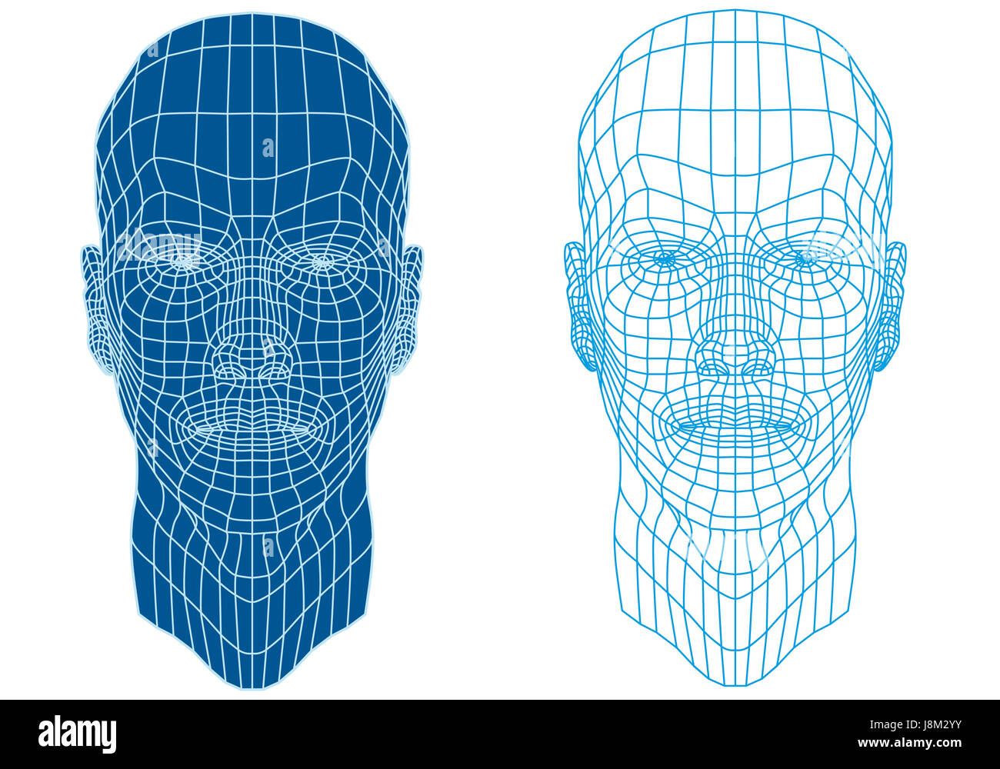
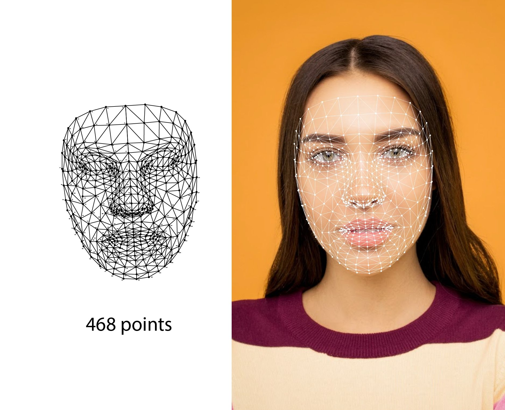
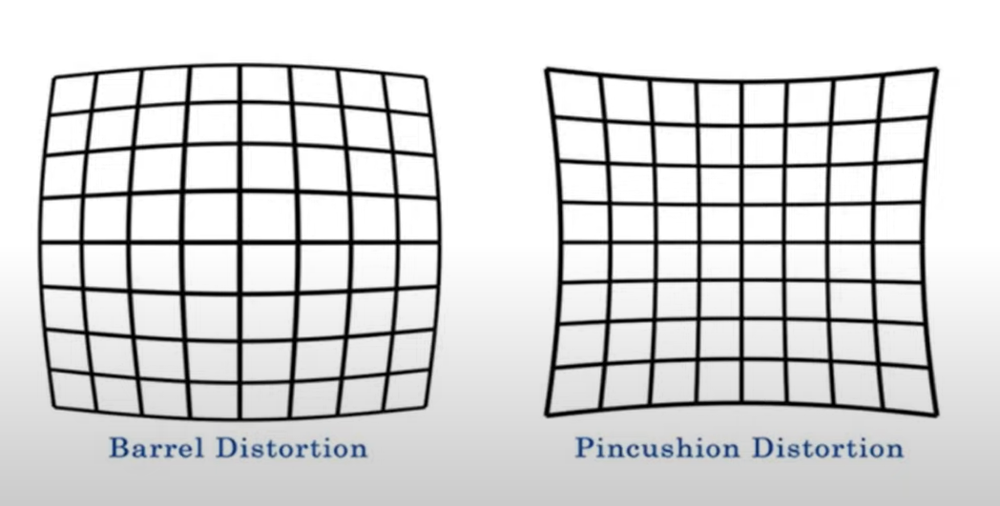
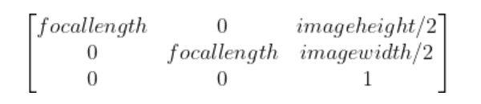
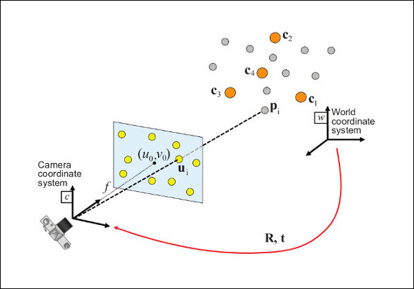

# Head Pose Estimation

## Problem:

Candidates may move their heads around while taking the test.

## Solution:

Recognise whenever they did that. 

## How-to-do:

**Step 1:** Take the face mesh from the Mediapipe library. Face mesh is our face with multiple points on that. 

In Mediapipe, the face mesh returned back will contain 468 points in total spreading our face. 

**Step 2:** Take the frames from the camera, flip it up, change it to BGR color and apply the face mesh from the Mediapipe on them. 

**Step 3:** For every face landmark collected from the frame, I did these steps sequentially: 

- First, I created a face_2d and a face_3d list to store the image information.

- Because the image taken from the landmark was normalized, I denormalized it by multiply it with the height and the width of the images corresponding.

- After that, for every picture, I added x and y for the face_2d and x, y and z for the face_3d. 

- Then I used a technique: camera calibration to remove distortion on the camera. 

- First I calculated the camera focal length, which is the width of the image.
- Then, I calculate the camera matrix, which is:

- After that, I used the PnP function in CV2, which is a pose computation method to calculate the 3D point of the object corresponding to the camera frames to take the rotational vectors out. 

- Next, I used the Rodrigues function to turn the rotational vectors into the rotational matrices. 
- Finnally, I used the RQDecomp3x3 to take the angles from the matrices outs. 

**Step 4:** After receiving the angles, I changed it into degree format. Then, I found these angles to be the tilting angle of the face. 

| Angle | x-coordinate | y-coordinate | Result     | 
|-------|--------------|--------------|------------|
| 15    | bigger       | bigger       | Out screen |  
| -15   | smaller      | smaller      | Out screen |

 
## Reference: 

- [Camera Calibration and 3D Reconstruction](https://docs.opencv.org/4.x/d9/d0c/group__calib3d.html)

     
