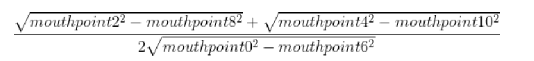

# Mouth Opening

## Problem: 
Candidates may talk to seek help during the test. 

## Solution: 
Recognize whenever they do that.

## How-to-do: 

## How-to-do 

### Step 1: 

Use the dlib library to detect 68 different landmarks on the candidates face. 

### Step 2: 

Take every frame from the camera, flip it, turn it into gray color, then use the detector from the dlib library to detect faces.

### Step 3: 

For every face, take the landmarks from these faces.

### Step 4: 

Take the landmarks for the mouth, then calculate the mouth ratio by the formula: 

Take the threshold, compare it with the mouth ratio, then decide whether it opening or not. 

I found the optimal threshold is about 0.74