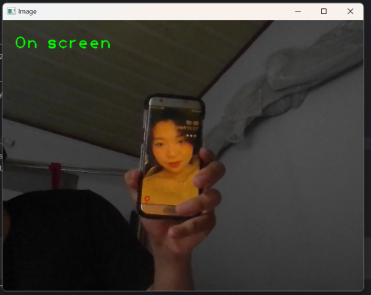
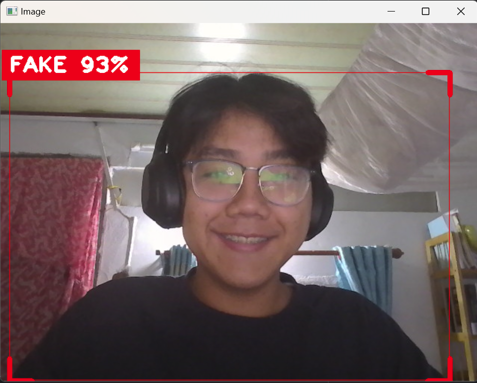
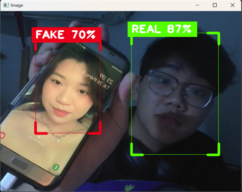
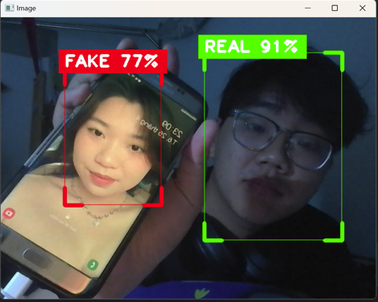

# Spoofing Detection 

## Problem 

The candidates can fake there faces by the images or the phone, this idea was taken for me while I took the head pose estimation test.

The image showed that the mediapipe library, which is core in my head pose estimation solution, is bad in detect real/fake faces. 

This may lead to the potential of candidates exploiting this mistake. 

## Solution 

Detect the real and fake face. 

## How-to-do 

**Step 1:** First, I tried with the SOTA model in face detection YOLOv8. Due to my lack of computation in my laptop, I just use the v8 Nano version. And the results were bad, it mislabeled all the fake and real face images. So I decided to train it on my own dataset to get better results. 

**Step 2:** Data collecting phase 

I used the YOLOv8 to detect the face, all real face and fake face, then detecting my face, change the bounding box to better fit with my face. 

After that, I used the Blurriness value to decide if any face was detected. If not, I won't store that data. 

Then, I saved it into data/all folder, with 0 for fake and 1 for real, storing in YOLO format, and collected the data. 

The real dataset was collected from 5 person: 1 male, 4 female, with 5284 images. 

The fake dataset was collected by random images taken from the Internet, with the same 5284 images. 

All file's name was stored in time exchange formats to prevent duplication. 

**Step 3**: Splitting the data: 

I split the dataset with the ratio: 0.7 for train, 0.1 for test and 0.2 for validation. 

These images were shuffled using the random function with file's names.

From 5284 images, I split 3700 images for train, 1056 images for validation and 528 images for testing. 

**Step 4**: Training

Due to my lack of computation on my Laptop, I trained on Google Colab, here are my specs for training: 
- Epoches = 300 
- Patience = 25 

**Step 5**: Testing 
Unfortunately, I can't upload the whole model on to GitHub. You can contact me by email lenam1072004@gmail.com to get the weights of the model. 

**Results** 

I can't run it for a long time because my laptop doesn't have a GPU, but here is two pictures I can capture from the results. 

